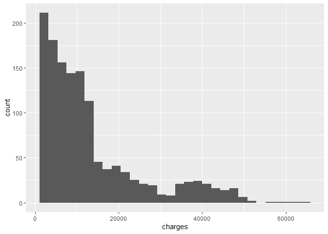
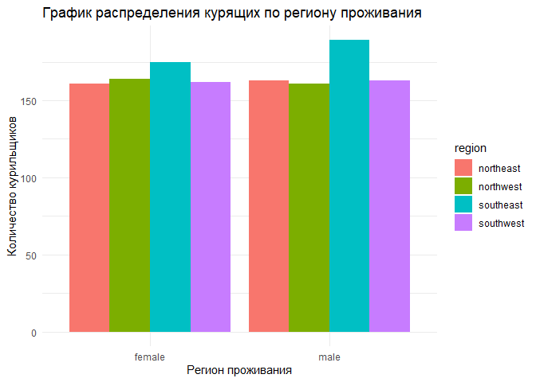

Задание 1

```r
library(tidyverse)
```

```
## -- Attaching packages --------------------------------------- tidyverse 1.3.2 --
## v ggplot2 3.3.6     v purrr   0.3.4
## v tibble  3.1.8     v dplyr   1.0.9
## v tidyr   1.2.1     v stringr 1.4.1
## v readr   2.1.2     v forcats 0.5.2
## -- Conflicts ------------------------------------------ tidyverse_conflicts() --
## x dplyr::filter() masks stats::filter()
## x dplyr::lag()    masks stats::lag()
```

```r
setwd("C:/Users/Ирина/Documents") 
data <- read.csv('insurance_cost.csv')
head(data)
```

```
##   age    sex    bmi children smoker    region   charges
## 1  19 female 27.900        0    yes southwest 16884.924
## 2  18   male 33.770        1     no southeast  1725.552
## 3  28   male 33.000        3     no southeast  4449.462
## 4  33   male 22.705        0     no northwest 21984.471
## 5  32   male 28.880        0     no northwest  3866.855
## 6  31 female 25.740        0     no southeast  3756.622
```

```r
summary(data)
```

```
##       age            sex                 bmi           children    
##  Min.   :18.00   Length:1338        Min.   :15.96   Min.   :0.000  
##  1st Qu.:27.00   Class :character   1st Qu.:26.30   1st Qu.:0.000  
##  Median :39.00   Mode  :character   Median :30.40   Median :1.000  
##  Mean   :39.21                      Mean   :30.66   Mean   :1.095  
##  3rd Qu.:51.00                      3rd Qu.:34.69   3rd Qu.:2.000  
##  Max.   :64.00                      Max.   :53.13   Max.   :5.000  
##     smoker             region             charges     
##  Length:1338        Length:1338        Min.   : 1122  
##  Class :character   Class :character   1st Qu.: 4740  
##  Mode  :character   Mode  :character   Median : 9382  
##                                        Mean   :13270  
##                                        3rd Qu.:16640  
##                                        Max.   :63770
```

Задание 2

```r
ggplot() +
  geom_histogram(data = data, aes(x=age))
```

```
## `stat_bin()` using `bins = 30`. Pick better value with `binwidth`.
```

<!-- -->

```r
ggplot() +
  geom_histogram(data = data, aes(x=bmi))
```

```
## `stat_bin()` using `bins = 30`. Pick better value with `binwidth`.
```

<!-- -->

```r
ggplot() +
  geom_histogram(data = data, aes(x=children))
```

```
## `stat_bin()` using `bins = 30`. Pick better value with `binwidth`.
```

<!-- -->

```r
ggplot() +
  geom_histogram(data = data, aes(x=charges))
```

```
## `stat_bin()` using `bins = 30`. Pick better value with `binwidth`.
```

<!-- -->


Задание 3

```r
mean_charges <- round(mean(data$charges), 0)
median_charges <- round(median(data$charges), 0)

plot1 <- ggplot(data=data, aes(x=charges)) +
  geom_density() +
  geom_vline(aes(xintercept = mean_charges, col = 'blue')) +
  geom_vline(aes(xintercept = median_charges, col = 'red')) +
  annotate("text", 
           x= mean_charges+10000,
           y=0.00004, 
           label=paste0("Mean= ", mean_charges)) +
  annotate("text",
           x= mean_charges+10000,
           y=0.00005, 
           label=paste0("Median= ", median_charges)) +
  ggtitle('График плотности по переменной charges') +
  labs(y = "Плотность переменной", x='Затраты на лечение') +
  #legend(col=c('blue', 'red'), x=c('v', 'v1')) +
  scale_color_manual(name='Легенда:', labels = c('медиана', 'среднее') , values=c('red', 'blue')) +
  theme_minimal()

plot1
```

<!-- -->

Задание 4
<br>
Сделайте три box_plot по отношению переменных charges и (1) sex (2) smoker (3)
region. Подберите тему для графика. Назовите оси.

```r
plot2 <- ggplot() +
  geom_boxplot(data = data, aes(x = charges, y=sex)) +
  labs(y = "Пол", x='Затраты на лечение') +
  theme_minimal() 
  
plot3 <- ggplot() +
  geom_boxplot(data = data, aes(x=charges, y=smoker)) +
  labs(y = "Курение", x='Затраты на лечение') +
  theme_minimal() 

plot4 <- ggplot() +
  geom_boxplot(data = data, aes(x=charges, y=region)) +
  labs(y = "Регион", x='Затраты на лечение') +
  theme_minimal() 

plot2
```

<!-- -->

```r
plot3
```

<!-- -->

```r
plot4
```

<!-- -->

Задание 5


```r
library(ggpubr)

combine_plot <- ggarrange(plot2, plot3, plot4, ncol = 3, nrow = 1)
combine_plot <- ggarrange(plot1, combine_plot, ncol = 1, nrow = 2)
combine_plot
```

<!-- -->

```r
#?ggarrange
```

задание 6
<br>
Сделайте фасет графика из задания 3 по колонке region.


```r
plot1 + facet_grid(region ~ . )
```

<!-- -->

задание 7
<br>
Постройте scatter plot отношения переменных age и charges. Добавьте названия
осей, название графика и тему. Сделайте так, чтобы числа по оси Х отображались
14 шрифтом.


```r
plot5 <- ggplot() +
  geom_point(data=data, aes(x=age, y=charges)) +
  labs(y = "Затраты на лечение", x='Возраст') +
  ggtitle('График зависимости затрат на лечение от возраста') +
  theme_minimal() +
  theme(axis.text.x = element_text(size=14))

plot5
```

<!-- -->

```r
#?theme
```
Задание 8
<br>
Проведите линию тренда для предыдущего графика.


```r
plot5 + 
  geom_smooth(data=data, aes(x=age, y=charges), method=lm)
```

```
## `geom_smooth()` using formula 'y ~ x'
```

<!-- -->

Задание 9
<br>
Сделайте разбивку предыдущего графика по колонке smoker (у вас должно
получится две линии тренда для курящих и нет).


```r
plot5 + 
  geom_smooth(data=data, aes(x=age, y=charges, group=smoker, color = smoker), method=lm)
```

```
## `geom_smooth()` using formula 'y ~ x'
```

<!-- -->

Задание 10
<br>
Сделайте график из заданий 7-9, но вместо переменной age используйте
переменную bmi.


```r
ggplot(data=data, aes(x=bmi, y=charges, group=smoker, color = smoker, fill=smoker)) +
  geom_point() +
  labs(y = "Затраты на лечение", x='ИМТ') +
  ggtitle('График зависимости затрат на лечение от показателя ИМТ') +
  theme_minimal() +
  theme(axis.text.x = element_text(size=14)) +
  geom_smooth(method=lm)
```

```
## `geom_smooth()` using formula 'y ~ x'
```

<!-- -->


Задание 11
<br>
Данный график поможет узнать, где больше курящих людей - среди мужчин или среди женщин? Эта информация может повлиять в будущем на цену страховки для этих двух категорий.


```r
ggplot()+
  geom_bar(data = data, aes(x = sex, fill = smoker), position = "dodge")+
  ggtitle('График распределения курящих между мужчинами и женщинами') +
  labs(x = "Пол", y = "Количество курильщиков")
```

<!-- -->
<br>
Явной взаимосвязи между полом и количеством курящих людей не обнаружено


Задание 12
<br>
В каком регионе больше курящих людей?

```r
ggplot()+
  geom_bar(data = data, aes(x = sex, fill = region), position = "dodge")+
  ggtitle('График распределения курящих по региону проживания') +
  labs(x = "Регион проживания", y = "Количество курильщиков") +
  theme_minimal()
```

<!-- -->
<br>
Больше всего курящих людей проживают в юго-восточном регионе (как среди женщин, так и среди мужчин).

Задание 13
<br>
Есть ли корреляция между затратами на лечение и ИМТ?

```r
data <- data %>% 
  mutate(
    age_group = case_when( #множественное условие
      age < 35 ~ "age: 21-34", 
      age >= 35 & age < 50 ~ "age: 35-49", 
      age >= 50 ~ "age: 50+"  ))

ggplot() +
  geom_point(data=data, aes(x=bmi, y=charges, color=age_group)) +
  geom_smooth(data=data, aes(x=bmi, y=charges), method = lm, color='red') +
  ggtitle('График зависимости затрат на лечение от индекса ИМТ') +
  labs(x='ИМТ',y='Затраты на лечение')
```

```
## `geom_smooth()` using formula 'y ~ x'
```

<!-- -->
<br>
Чем выше ИМТ, тем выше в среднем становятся затраты на лечение. Также по графику видно, что наименьшие затраты на лечение в возрастной группе 21-34 года.
<br>
задание 14


```r
data <- data %>% 
  mutate(
    age_group = case_when( #множественное условие
      age < 35 ~ "age: 21-34", 
      age >= 35 & age < 50 ~ "age: 35-49", 
      age >= 50 ~ "age: 50+"  ))

  ggplot(data, aes(x=bmi, y=log(charges), group = age_group, color = age_group)) +
    geom_point(size=1.5, color='#330033', alpha=0.4) +
    facet_grid(.~ age_group) +
    geom_smooth(method=lm) +
    theme_minimal() +
    theme(legend.position = "bottom")
```

```
## `geom_smooth()` using formula 'y ~ x'
```

<!-- -->


